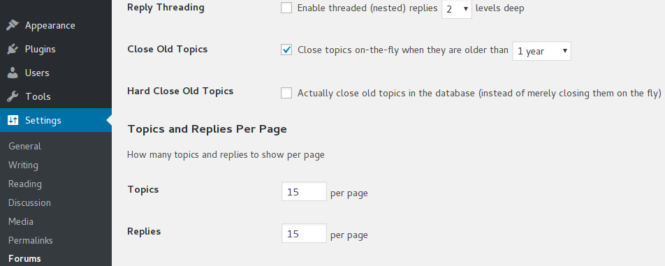

# BBP Close Old Topics
**Contributors:** iceable  
**Tags:** bbpress, bbp, close, topics, forums  
**Requires at least:** 4.0  
**Tested up to:** 4.8.2  
**Stable tag:** 1.0  
**License:** GPLv2 or later  
**License URI:** http://www.gnu.org/licenses/gpl-2.0.html  
**Donate link:** http://www.iceable.com/buy-me-a-beer/

Extension for bbPress to close old topics automatically when they are older than an admin-defined period of time.

## Description

BBP Close Old Topics is a bbPress extension to close old topics automatically when they are older than an admin-defined period of time, from one week to one year.

The period of time you set is compared to the topic freshness (usually based on the date of the last reply) to determine if a topic should be closed.

Old topics can be "soft-closed" on the fly only, or actually closed in the database.

Settings are in Settings > Forums, under "Forum Features".

If you choose to only soft-close old topics on the fly, they will only appear closed as long as the plugin is active, but you will find them still open if you disable it.

If you check the "Hard close" option, every topic that gets closed on the fly will also be effectively closed in the database. In this case they will remain closed even if you disable this plugin.

__This plugin only works with bbPress 2.2 or later.__ It will not have any effect if bbPress is not installed and activated, and will  not work correctly with any version older than 2.2. This plugin was tested with bbPress up to 2.5.14.

## Installation

### From GitHub

1. Clone or Download this repo.
2. Unzip it and upload the 'bbp-close-old-topics' directory to your '/wp-content/plugins/' directory, using your favorite method (ftp, FileManager, etc...)
3. Activate BBP Close old Topics from your Plugins page in wp-admin.

### From your WordPress dashboard

1. Visit 'Plugins > Add New'
2. Search for 'BBP Close old Topics'
3. Activate BBP Close old Topics from your Plugins page in wp-admin.

### From WordPress.org

1. Download [BBP Close old Topics](https://wordpress.org/plugins/bbp-close-old-topics/).
2. Unzip it and upload the 'bbp-close-old-topics' directory to your '/wp-content/plugins/' directory, using your favorite method (ftp, FileManager, etc...)
3. Activate BBP Close old Topics from your Plugins page in wp-admin.

## Configuration

1. Visit 'Settings > Forums' and set the settings in the "Forum Features" section.
2. Check the "Close Old Topics" box to enable this feature, and set how old posts should be before closing them (1 year by default).
3. Optionally check the "Hard Close Old Topics" if you want topics to be actually closed in the database.

## Frequently Asked Questions

### It doesn't do anything, there isn't even any settings!

__This plugin only works with bbPress 2.2 or later.__ It will not have any effect if bbPress is not installed and activated, and will  not work correctly with any version older than 2.2. This plugin was tested with bbPress up to 2.5.14.

### Things won't work

Please create a thread in the [support forum](https://wordpress.org/support/plugin/bbp-close-old-topics) and make sure to explain your issue with as much details as you can so it is possible to help you.

### It's great, I love it!

Brilliant! If you don't mind, I would really appreciate it if you left a [review](https://wordpress.org/support/plugin/bbp-close-old-topics/reviews/) with the appropriate number of stars.

### It's cool, and I think it could be even better

Suggestions are certainly welcome!  
Pull requests are also more than welcome on [GitHub](https://github.com/iceable/bbp-close-old-topics)

### I have another question/suggestion

Feel free to ask in the [support forum](https://wordpress.org/support/plugin/bbp-close-old-topics)!

## Screenshots

1. Settings in the bbPress Admin settings area.

## Credits

Some parts of the code of this plugin were inspired by the work of Brandon Allen: https://github.com/thebrandonallen/bbp-auto-close-topics

## Changelog

#### [1.0.0] - 2017-10-05
* Initial release.

## Translations

* English - default

__Note:__ This plugin is fully translation-ready. Please contribute your language to the plugin to make it even more useful for all users worldwide! For translating you can use the [Poedit Editor](http://www.poedit.net/) or contribute directly on [translate.wordpress.org](https://translate.wordpress.org/projects/wp-plugins/bbp-close-old-topics)
